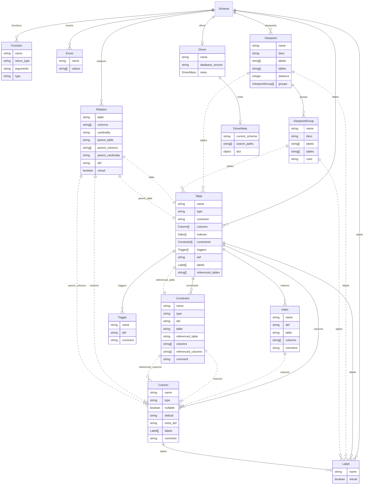

# tbls JSON Schema ER diagram

```mermaid
erDiagram
  Schema ||--o{ Table : tables
  Schema ||--o{ Relation : relations
  Schema ||--o{ Function : functions
  Schema ||--o{ Enum : enums
  Schema ||--o| Driver : driver
  Schema ||--o{ Label : labels
  Schema ||--o{ Viewpoint : viewpoints
  Table  ||--o{ Column : columns
  Table  ||--o{ Constraint : constraints
  Table  ||--o{ Index : indexes
  Table  ||--o{ Trigger : triggers
  Table  ||--o{ Label : labels
  Viewpoint ||--o{ ViewpointGroup : groups
  Viewpoint ||..o{ Table : tables
  Viewpoint ||..o{ Label : labels
  ViewpointGroup ||..o{ Table : tables
  ViewpointGroup ||..o{ Label : labels
  Column ||--o{ Label : labels
  Driver ||--o| DriverMeta : meta
  Index ||..|{ Column : columns
  Constraint ||..|| Table : referenced_table
  Constraint ||..|{ Column : columns
  Constraint ||..o{ Column : referenced_columns
  Relation ||..|{ Column : columns
  Relation ||..|{ Column : parent_columns
  Relation ||..|| Table : table
  Relation ||..|| Table : parent_table

  Table {
    string name
    string type
    string comment
    Column[] columns
    Index[] indexes
    Constraint[] constraints
    Trigger[] triggers
    string def
    Label[] labels
    string[] referenced_tables
  }

  Column {
    string name
    string type
    boolean nullable
    string default
    string extra_def
    Label[] labels
    string comment
  }

  Index {
    string name
    string def
    string table
    string[] columns
    string comment
  }

  Constraint {
    string name
    string type
    string def
    string table
    string referenced_table
    string[] columns
    string[] referenced_columns
    string comment
  }

  Trigger {
    string name
    string def
    string comment
  }

  Label {
    string name
    boolean virtual
  }

  Relation {
    string table
    string[] columns
    string cardinality
    string parent_table
    string[] parent_columns
    string parent_cardinality
    string def
    boolean virtual
  }

  Function {
    string name
    string return_type
    string arguments
    string type
  }

  Enum {
    string name
    string[] values
  }

  Driver {
    string name
    string database_version
    DriverMeta meta
  }

  DriverMeta {
    string current_schema
    string[] search_paths
    object dict
  }

  Viewpoint {
    string name
    string desc
    string[] labels
    string[] tables
    integer distance
    ViewpointGroup[] groups
  }

  ViewpointGroup {
    string name
    string desc
    string[] labels
    string[] tables
    string color
  }
```
