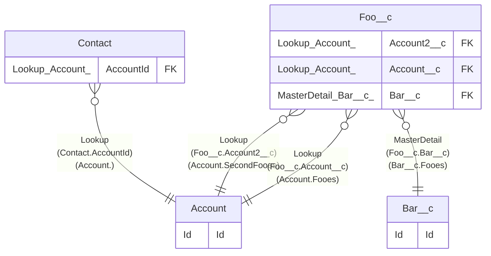

> [Home](README.md) / Account

# Account

## Description

## Columns

| Name | Type | Default | Nullable | Extra Definition | Children | Parents | Comment |
| ---- | ---- | ------- | -------- | ---------------- | -------- | ------- | ------- |
| AccountNumber | _ |  | true |  |  |  |  |
| AccountSource | Picklist |  | true |  |  |  |  |
| Active__c | Picklist |  | true | No; Yes |  |  | Active |
| AnnualRevenue | _ |  | true |  |  |  |  |
| BillingAddress | _ |  | true |  |  |  |  |
| CleanStatus | _ |  | true |  |  |  |  |
| CustomerPriority__c | Picklist |  | true | High; Low; Medium |  |  | Customer Priority |
| DandbCompanyId | Lookup |  | true |  |  |  |  |
| Description | _ |  | true |  |  |  |  |
| DunsNumber | _ |  | true |  |  |  |  |
| Fax | _ |  | true |  |  |  |  |
| Id | Id |  | false |  | [Contact](Contact.md) [Foo__c](Foo__c.md) |  | Id |
| Industry | Picklist |  | true |  |  |  |  |
| Jigsaw | _ |  | true |  |  |  |  |
| NaicsCode | _ |  | true |  |  |  |  |
| NaicsDesc | _ |  | true |  |  |  |  |
| Name | Name |  | false |  |  |  |  |
| NumberOfEmployees | _ |  | true |  |  |  |  |
| NumberofLocations__c | Number(3, 0) |  | true |  |  |  | Number of Locations |
| OwnerId | Lookup |  | true |  |  |  |  |
| Ownership | Picklist |  | true |  |  |  |  |
| ParentId | Hierarchy |  | true |  |  |  |  |
| Phone | _ |  | true |  |  |  |  |
| Rating | Picklist |  | true |  |  |  |  |
| SLAExpirationDate__c | Date |  | true |  |  |  | SLA Expiration Date |
| SLASerialNumber__c | Text(10) |  | true |  |  |  | SLA Serial Number |
| SLA__c | Picklist |  | true | Gold; Silver; Platinum; Bronze |  |  | SLA |
| ShippingAddress | _ |  | true |  |  |  |  |
| Sic | _ |  | true |  |  |  |  |
| SicDesc | _ |  | true |  |  |  |  |
| Site | _ |  | true |  |  |  |  |
| TickerSymbol | _ |  | true |  |  |  |  |
| Tier | _ |  | true |  |  |  |  |
| Tradestyle | _ |  | true |  |  |  |  |
| Type | Picklist |  | true |  |  |  |  |
| UpsellOpportunity__c | Picklist |  | true | Maybe; No; Yes |  |  | Upsell Opportunity |
| Website | _ |  | true |  |  |  |  |
| YearStarted | _ |  | true |  |  |  |  |

## Viewpoints

| Name | Definition |
| ---- | ---------- |
| [Foobar](viewpoint-0.md) | Foo and bar. |

## Constraints

| Name | Type | Definition |
| ---- | ---- | ---------- |
| Id | Primary Key | Primary Key |

## Indexes

| Name | Definition |
| ---- | ---------- |
| Id | Primary Key |
| Name | Name |

## Relations

---

> Generated by [tbls](https://github.com/k1LoW/tbls)

