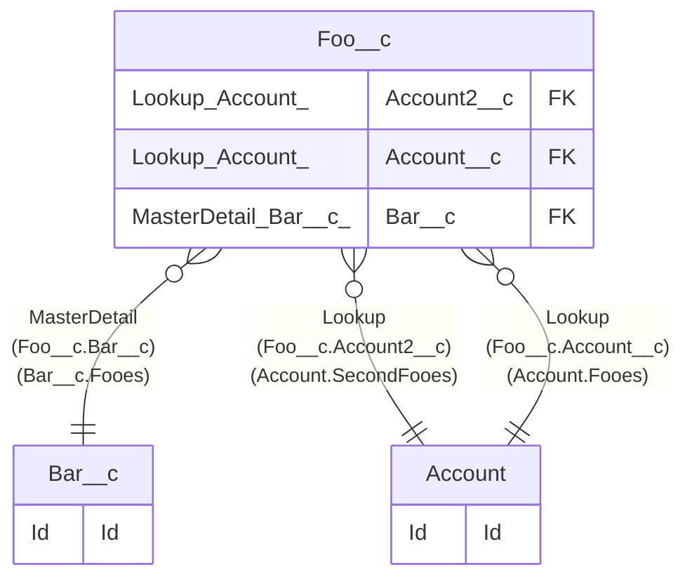

# Bar__c

## Description

Bar

## Columns

| Name | Type | Default | Nullable | Children | Parents | Comment |
| ---- | ---- | ------- | -------- | -------- | ------- | ------- |
| Id | Id |  | false | [Foo__c](Foo__c.md) |  | Id |
| Name | Name(Text) |  | false |  |  | Bar Name |

## Constraints

| Name | Type | Definition |
| ---- | ---- | ---------- |
| Id | Primary Key | Primary Key |

## Indexes

| Name | Definition |
| ---- | ---------- |
| Id | Primary Key |
| Name | Name(Text) |

## Relations

---

> Generated by [tbls](https://github.com/k1LoW/tbls)
