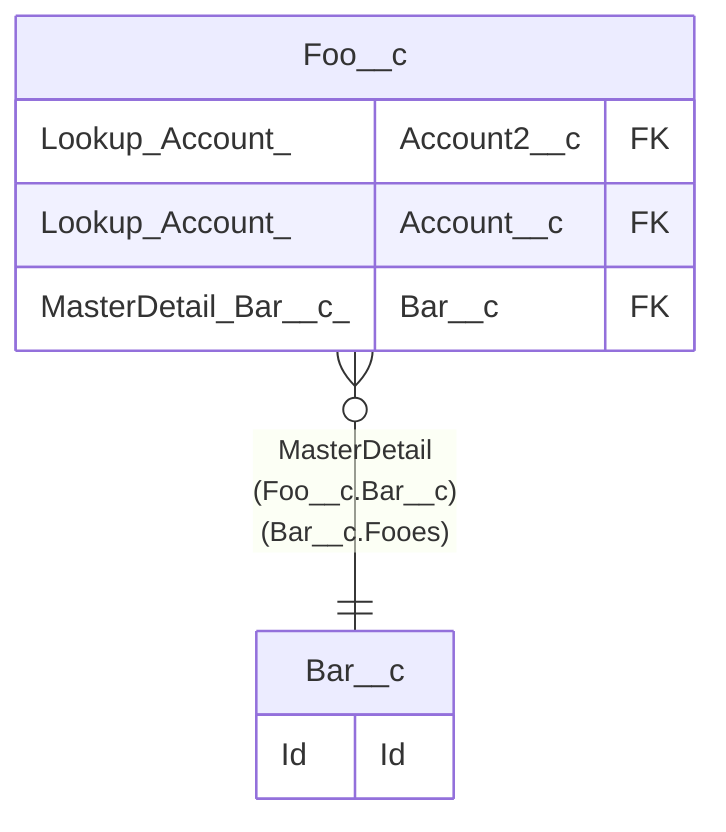

> [Home](README.md) / Bar__c

# Bar__c

## Description

Bar

## Columns

| Name | Type | Default | Nullable | Extra Definition | Children | Parents | Comment |
| ---- | ---- | ------- | -------- | ---------------- | -------- | ------- | ------- |
| Id | Id |  | false |  | [Foo__c](Foo__c.md) |  | Id |
| Name | Name(Text) |  | false |  |  |  | Bar Name |
| RecordTypeId | Record Type |  | false | Bar1; {Bar 2, Bar2} |  |  | Record Type |

## Viewpoints

| Name | Definition |
| ---- | ---------- |
| [Foobar](viewpoint-0.md) | Foo and bar. |

## Constraints

| Name | Type | Definition | Comment |
| ---- | ---- | ---------- | ------- |
| BarSharingRule1 | SharingOwnerRule | [Edit]; From AllInternalUsers; To RoleAndSubordinatesInternal{CEO} | Bar Sharing Rule1; description |
| BarSharingRule2 | SharingOwnerRule | [Read]; From Role{MarketingTeam}; To AllInternalUsers | Bar Sharing Rule2 |
| BarSharingRule3 | SharingCriteriaRule | [Read][IncludeRecordsOwnedByAll]; From {1 OR 2, Name startsWith A, Name equals B}; To AllInternalUsers | Bar Sharing Rule3 |
| Id | Primary Key | Primary Key |  |

## Indexes

| Name | Definition |
| ---- | ---------- |
| Id | Primary Key |
| Name | Name(Text) |

## Relations

---

> Generated by [tbls](https://github.com/k1LoW/tbls)
