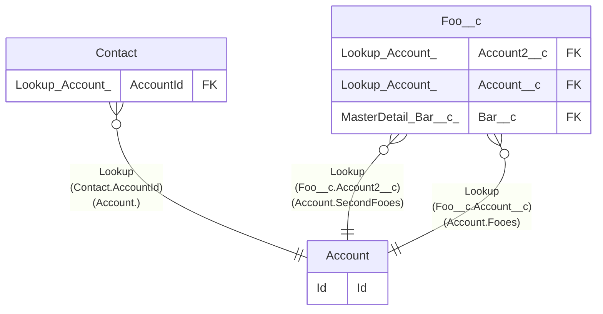

> [Home](README.md) / Contact

# Contact

## Description

## Columns

| Name | Type | Default | Nullable | Extra Definition | Children | Parents | Comment |
| ---- | ---- | ------- | -------- | ---------------- | -------- | ------- | ------- |
| AccountId | Lookup(Account) |  | true | Relation=; List= |  | [Account](Account.md) |  |
| AssistantName | _ |  | true |  |  |  |  |
| AssistantPhone | _ |  | true |  |  |  |  |
| Birthdate | _ |  | true |  |  |  |  |
| BuyerAttributes | Picklist |  | true |  |  |  |  |
| CleanStatus | _ |  | true |  |  |  |  |
| ContactSource | _ |  | true |  |  |  |  |
| Department | _ |  | true |  |  |  |  |
| Description | _ |  | true |  |  |  |  |
| DoNotCall | _ |  | true |  |  |  |  |
| Email | _ |  | true |  |  |  |  |
| Fax | _ |  | true |  |  |  |  |
| GenderIdentity | Picklist |  | true |  |  |  |  |
| HasOptedOutOfEmail | _ |  | true |  |  |  |  |
| HasOptedOutOfFax | _ |  | true |  |  |  |  |
| HomePhone | _ |  | true |  |  |  |  |
| Id | Id |  | false |  |  |  | Id |
| IndividualId | Lookup |  | true |  |  |  |  |
| Jigsaw | _ |  | true |  |  |  |  |
| Languages__c | Text(100) |  | true |  |  |  | Languages |
| LastCURequestDate | _ |  | true |  |  |  |  |
| LastCUUpdateDate | _ |  | true |  |  |  |  |
| LeadSource | Picklist |  | true |  |  |  |  |
| Level__c | Picklist |  | true | Secondary; Tertiary; Primary |  |  | Level |
| MailingAddress | _ |  | true |  |  |  |  |
| MobilePhone | _ |  | true |  |  |  |  |
| Name | Name |  | false |  |  |  |  |
| OtherAddress | _ |  | true |  |  |  |  |
| OtherPhone | _ |  | true |  |  |  |  |
| OwnerId | Lookup |  | true |  |  |  |  |
| Phone | _ |  | true |  |  |  |  |
| Pronouns | Picklist |  | true |  |  |  |  |
| ReportsToId | Lookup |  | true |  |  |  |  |
| Title | _ |  | true |  |  |  |  |

## Viewpoints

| Name | Definition |
| ---- | ---------- |
| [Foobar](viewpoint-0.md) | Foo and bar. |

## Constraints

| Name | Type | Definition |
| ---- | ---- | ---------- |
| Id | Primary Key | Primary Key |

## Indexes

| Name | Definition |
| ---- | ---------- |
| Id | Primary Key |
| Name | Name |

## Relations

---

> Generated by [tbls](https://github.com/k1LoW/tbls)

