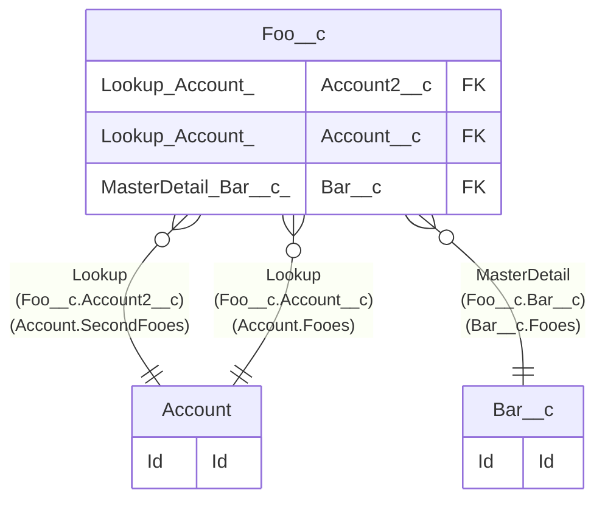

# Foo__c

## Description

Foo

## Columns

| Name | Type | Default | Nullable | Extra Definition | Children | Parents | Comment |
| ---- | ---- | ------- | -------- | ---------------- | -------- | ------- | ------- |
| Account2__c | Lookup(Account) |  | false | Relation=SecondFooes; List=Foo (Account2) |  | [Account](Account.md) | Account2; description |
| Account__c | Lookup(Account) |  | true | Relation=Fooes; List=Foo; Filter=Account.Rating equals Hot, Warm |  | [Account](Account.md) | Account; description |
| Bar__c | MasterDetail(Bar__c) |  | true | Relation=Fooes; List=Foo |  | [Bar__c](Bar__c.md) | Bar |
| Id | Id |  | false |  |  |  | Id |
| MyAutoNumber__c | AutoNumber |  | true | A-{00000000} |  |  | MyAutoNumber; description text |
| MyCheckbox__c | Checkbox | true | true |  |  |  | MyCheckbox; description |
| MyChildPicklist__c | Picklist |  | false | P; Q; R |  |  | MyChildPicklist; description |
| MyCurrency__c | Currency(18, 2) | 0 | false |  |  |  | MyCurrency; description |
| MyDateTime__c | DateTime | NOW() | false |  |  |  | MyDateTime; description |
| MyDate__c | Date | TODAY() | false |  |  |  | MyDate; description |
| MyEmail__c | Email | "foo@example.com" | false |  |  |  | MyEmail; description |
| MyEncryptedText__c | EncryptedText(175) |  | false | all, asterisk |  |  | MyEncryptedText; description |
| MyFormula__c | Formula(Checkbox, BlankAsZero) |  | true | 1=2 |  |  | MyFormula; description text |
| MyGeolocation__c | Location |  | false | DisplayLocationInDecimal |  |  | MyGeolocation; description |
| MyGlobalPicklist__c | Picklist |  | false | [Global:MyGlobalPickValue]; [Default] {Value H, H}; {Value I, I}; {Value J, J}; {Value K, K} |  |  | MyGlobalPicklist; description |
| MyLongTextArea__c | LongTextArea(32768) | TEXT(UNIXTIMESTAMP(NOW())) | true |  |  |  | MyLongTextArea; description |
| MyMultiPicklist__c | MultiselectPicklist | "Z" | false | [Default] {Value X, X}; {Value Y, Y}; {Value Z, Z} |  |  | MyMultiPicklist; description |
| MyNumber__c | Number(18, 4) | 0 | false |  |  |  | MyNumber; description |
| MyPercent__c | Percent(18, 2) | 0 | false |  |  |  | MyPercent; description |
| MyPhone__c | Phone | "000-0000-0000" | false |  |  |  | MyPhone; description |
| MyPicklist__c | Picklist | "A" | false | {Value A, A}; {Value B, B}; {Value C, C}; [Default] {Value D, D}; {Value E, E} |  |  | MyPicklist; description |
| MyRichTextArea__c | Html(32768) |  | true |  |  |  | MyRichTextArea; description |
| MyTextArea__c | TextArea | TEXT(UNIXTIMESTAMP(NOW())) | false |  |  |  | MyTextArea; description |
| MyText__c | Text(255) | TEXT(UNIXTIMESTAMP(NOW())) | false |  |  |  | MyText; description |
| MyTime__c | Time | TIMENOW() | false |  |  |  | MyTime; description |
| MyURL__c | Url | "https://www.example.com" | false |  |  |  | MyURL; description |
| Name | Name(AutoNumber) |  | false | F-{00000000} |  |  | Foo Name |

## Constraints

| Name | Type | Definition | Comment |
| ---- | ---- | ---------- | ------- |
| FooRestrictionRule1 | Restrict | $User.IsActive=true; CreatedBy.Division=$User.Division | description |
| FooScopingRule1 | Scoping | $User.IsActive=true; CreatedBy.Division=$User.Division | description |
| Id | Primary Key | Primary Key |  |
| MyEmail__c | Unique | Unique Case Sensitive |  |
| MyNumber__c | Unique | Unique Case Insensitive |  |
| MyTextValidationRule1 | ValidationRule | [MyText__c] LEN(MyText__c)<3 | description |
| MyText__c | Unique | Unique Case Insensitive |  |

## Indexes

| Name | Definition |
| ---- | ---------- |
| Id | Primary Key |
| MyAutoNumber__c | Nonunique External Id |
| MyEmail__c | Unique External Id |
| MyNumber__c | Unique External Id |
| MyText__c | Unique External Id |
| Name | Name(AutoNumber) |

## Triggers

| Name | Definition | Comment |
| ---- | ---------- | ------- |
| flow.FooTriggerFlow1 | CreateAndUpdate, RecordAfterSave | Foo Trigger Flow 1 |
| trigger.FooTrigger1 | before insert, before update |  |

## Relations

---

> Generated by [tbls](https://github.com/k1LoW/tbls)
