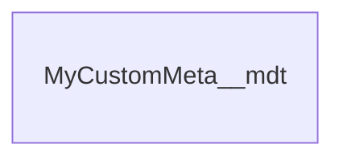

> [Home](README.md) / MyCustomMeta__mdt

# MyCustomMeta__mdt

## Description

MyCustomMeta

## Columns

| Name | Type | Default | Nullable | Children | Parents | Comment |
| ---- | ---- | ------- | -------- | -------- | ------- | ------- |
| Id | Id |  | false |  |  | Id |
| MyText__c | Text(255) |  | false |  |  | MyText; description |

## Constraints

| Name | Type | Definition |
| ---- | ---- | ---------- |
| Id | Primary Key | Primary Key |
| MyText__c | Unique | Unique Case Insensitive |

## Indexes

| Name | Definition |
| ---- | ---------- |
| Id | Primary Key |

## Relations

---

> Generated by [tbls](https://github.com/k1LoW/tbls)

