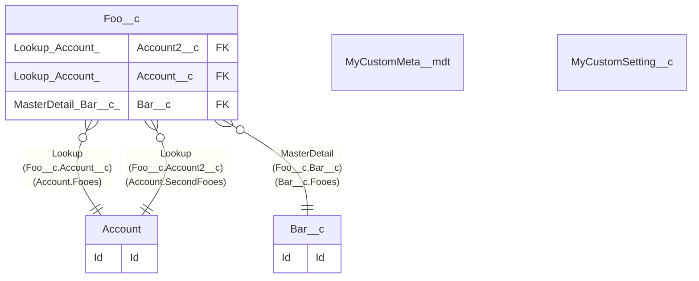

# 

## Tables

| Name | Columns | Comment | Type |
| ---- | ------- | ------- | ---- |
| [Account](Account.md) | 38 |  | Standard object |
| [Bar__c](Bar__c.md) | 2 | Bar | Custom object |
| [Foo__c](Foo__c.md) | 27 | Foo | Custom object |
| [MyCustomMeta__mdt](MyCustomMeta__mdt.md) | 2 | MyCustomMeta | Custom metadata |
| [MyCustomSetting__c](MyCustomSetting__c.md) | 2 | MyCustomSetting | Custom setting |

## Relations

---

> Generated by [tbls](https://github.com/k1LoW/tbls)
