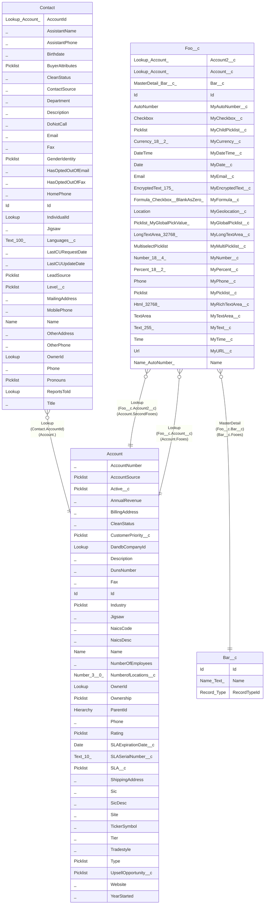

> [Home](README.md) / Foobar

# Foobar

## Description

Foo and bar.

## Tables

### Custom

Custom objects

| Name | Columns | Comment | Type |
| ---- | ------- | ------- | ---- |
| [Bar__c](Bar__c.md) | 3 | Bar | Custom object |
| [Foo__c](Foo__c.md) | 27 | Foo | Custom object |

### Standard

Standard objects

| Name | Columns | Comment | Type |
| ---- | ------- | ------- | ---- |
| [Account](Account.md) | 38 |  | Standard object |
| [Contact](Contact.md) | 34 |  | Standard object |

## Relations

---

> Generated by [tbls](https://github.com/k1LoW/tbls)
